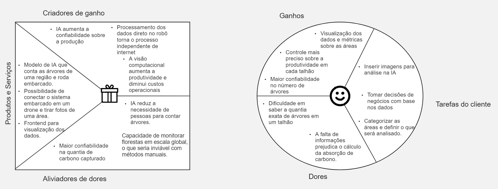

# Introdução

O canvas de proposta de valor é uma ferramenta visual que ajuda a definir e comunicar de maneira clara como a solução que o grupo vem desenvolvendo atende às necessidades específicas do parceiro de projeto. O canva descreve e destaca os aspectos que tornam o produto que será desenvolvido em uma solução única, destacando os problemas que ela resolve, as vantagens que oferece, os benefícios-chave para os clientes e o valor exclusivo que a diferencia da concorrência. Assim, o canvas de proposta de valor é uma ferramenta prática e estratégica para construir uma melhor entendimento de como o produto atende as dores do público-alvo e impulsiona o sucesso do negócio.

# O Canvas

Assim, com o objetivo de desenvolver uma solução para a Abundance que conta o número de árvores em um terreno para melhorar o cálculo dos créditos de carbono gerados em uma área de floresta plantada foi pensado o seguinte canvas proposta de valor.

Na figura acima, do lado esquerdo temos o produto e suas características e do lado direito há o consumidor. Assim, a solução em desenvolvimento visa resolver a dor de saber quantas árvores existem em um talhão, focando na contagem precisa de árvores em uma região específica.

## Detalhamento do Canvas de Proposta de Valor

### Produtos e Serviços (Lado Esquerdo)

1. Modelo de IA que conta as árvores de uma região e roda embarcado:

- Este modelo é a peça central da solução, utilizando visão computacional para identificar e contar árvores em um determinado talhão. Ele funciona diretamente no hardware embarcado, o que permite que a contagem ocorra em tempo real, sem necessidade de uma conexão constante com a internet.

2. Possibilidade de conectar o sistema embarcado em um drone e tirar fotos de uma área:

- A utilização de drones amplia a aplicação do sistema, permitindo que áreas maiores sejam cobertas de maneira eficiente e precisa. Isso facilita o mapeamento de grandes regiões e melhora a precisão na contagem de árvores.

3. Frontend para visualização dos dados:

- Um frontend amigável é crucial para permitir que os usuários visualizem e interpretem os dados gerados pelo sistema. Isso inclui métricas como número de árvores, localização, e estimativas de carbono capturado, tudo de maneira intuitiva e acessível.

### Alivios de Dores

1. Maior confiabilidade na quantia de carbono capturado:

- Ao fornecer uma contagem precisa das árvores, a solução permite um cálculo mais exato do carbono capturado, o que é essencial para a certificação e comercialização de créditos de carbono.

2. IA reduz a necessidade de pessoas para contar árvores:

- A automatização do processo de contagem elimina a necessidade de inspeções manuais, que são caras, demoradas, e propensas a erros humanos.

3. Capacidade de monitorar florestas em escala global, o que seria inviável com métodos manuais:

- A escalabilidade do sistema permite que grandes áreas florestais sejam monitoradas de maneira eficiente, algo que seria impraticável se feito manualmente.

### Criadores de Ganho

1. IA aumenta a confiabilidade sobre a produção:

- A inteligência artificial oferece precisão e consistência, assegurando que a contagem de árvores seja sempre precisa, o que é vital para relatórios e tomadas de decisão.

2. Processamento dos dados direto no robô torna o processo independente de internet:

- A independência da internet reduz a vulnerabilidade a problemas de conectividade, tornando o sistema mais robusto e confiável em áreas remotas.

3. A visão computacional aumenta a produtividade e diminui custos operacionais:

- O uso de visão computacional não apenas melhora a precisão, mas também acelera o processo de contagem, permitindo que as operações sejam mais produtivas e menos custosas.

### Ganhos

1. Visualização dos dados e métricas sobre as áreas:

- Oferecer uma interface de fácil entendimento para visualização de dados é um diferencial importante, permitindo aos gestores florestais tomar decisões informadas com base em dados atualizados.

2. Controle mais preciso sobre a produtividade em cada talhão:

- Saber o número exato de árvores em cada área permite um controle mais rigoroso da produtividade e facilita o planejamento e a gestão das operações florestais.

3. Maior confiabilidade no número de árvores:

- A confiabilidade na contagem de árvores ajuda a evitar sub ou superestimação de recursos, garantindo a precisão nas estimativas de crédito de carbono.

# Conclusão

Esse canvas de proposta de valor destaca como a solução não apenas resolve as dores específicas do cliente, mas também cria novos ganhos em termos de eficiência, confiabilidade, e escalabilidade. Com essas melhorias, sua solução para a Abundance se posiciona como uma ferramenta essencial para a gestão de florestas plantadas e o mercado de créditos de carbono.
