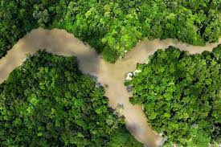
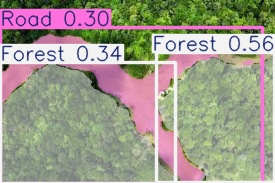

# Yolo

## Introdução

O modelo YOLO (You Only Look Once) de segmentação é uma evolução do famoso modelo YOLO, originalmente criado para detecção de objetos em imagens. Enquanto o YOLO tradicional se concentra em localizar e classificar objetos dentro de uma imagem através de caixas delimitadoras (bounding boxes), a versão de segmentação vai um passo além, fornecendo uma máscara de pixel precisa para cada objeto detectado.

O YOLO de segmentação combina a rapidez e a eficiência características do YOLO com a precisão da segmentação de imagens. Este modelo é capaz de realizar a detecção e a segmentação simultaneamente, o que o torna uma escolha poderosa para aplicações em tempo real, como em sistemas de vigilância, assistência médica, e em veículos autônomos.

A segmentação de objetos é realizada por meio da predição de uma máscara binária para cada objeto identificado, onde cada pixel da máscara indica se ele pertence ou não ao objeto. Isso permite que o modelo não só identifique e localize os objetos, mas também contorne com precisão suas formas.

## Treinamento do Modelo YOLO de Segmentação

Para treinar o modelo YOLO de segmentação, foi necessário utilizar três datasets diferentes para encontrar a melhor performance. Cada dataset resultou em diferentes níveis de precisão na segmentação, e o melhor resultado foi alcançado com o dataset [Landscape segmentation](https://universe.roboflow.com/myproject-gccot/landscape-segmentation), disponibilizado pelo [Roboflow](https://roboflow.com/).

### Detalhes do Treinamento

- **Quantidade de Imagens:** Aproximadamente 2.100
- **Número de Épocas:** 20
- **Tempo de Treinamento:** Cerca de 30 minutos
- **Infraestrutura Utilizada:** Computador com alta capacidade de processamento

### Modelo Utilizado

Vale destacar que o modelo utilizado para a segmentação foi uma versão específica da [Ultralytics YOLO](https://docs.ultralytics.com/tasks/segment/), adaptada para essa tarefa.

## Uso do Modelo

O uso do modelo se baseia em um código em Python que utiliza a biblioteca da Ultralytics combinada com OpenCV. Ao treinar o modelo, é gerado um arquivo chamado `best.pt`, que contém as métricas avaliativas do processo de treinamento. Este arquivo é essencial para a predição e segmentação realizadas pelo modelo.

O código pode ser encontrado na pasta `yolo_model` localizada em `src/modelos/yolo_model`. Para executá-lo, siga os comandos abaixo:

```
pip install ultralytics
cd src/models/yolo_model/model_scrip
python model.py
```

Com isso, o modelo será capaz de gerar a imagem já segmentada.

## Resultados Encontrados

Na primeira versão, o modelo apresentou bons resultados, com uma identificação eficaz de áreas com grande quantidade de árvores, estradas e, em alguns casos, vegetação alta que não são árvores.

Abaixo, podemos observar as imagens e vídeos gerados pelo modelo:

- Primeira imagem sem o processamento vs. Primeira imagem já processada

 

O modelo apresentou uma boa identificação e segmentação visual.

Agora, realizamos o mesmo teste utilizando o mesmo script, mas com um vídeo.

<iframe width="560" height="315" src="https://www.youtube.com/embed/ofJtLonEPzA?si=sLl2jqDqe10iecS6" title="YouTube video player" frameborder="0" allow="accelerometer; autoplay; clipboard-write; encrypted-media; gyroscope; picture-in-picture; web-share" referrerpolicy="strict-origin-when-cross-origin" allowfullscreen></iframe>

O segundo vídeo apresentou mais dificuldades na segmentação devido à angulação do drone. Este teste foi realizado propositalmente para avaliar as capacidades reais do modelo.

<iframe width="560" height="315" src="https://www.youtube.com/embed/ncu7SWArS9w?si=U9SSy7urY1NnxEdO" title="YouTube video player" frameborder="0" allow="accelerometer; autoplay; clipboard-write; encrypted-media; gyroscope; picture-in-picture; web-share" referrerpolicy="strict-origin-when-cross-origin" allowfullscreen></iframe>
