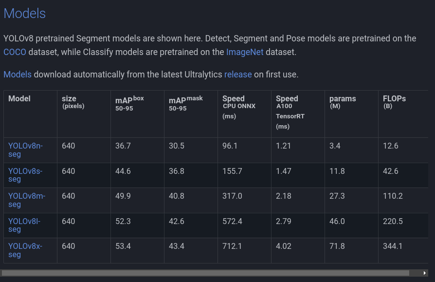

# Metricas de Avalição do Modelo

## Sobre o Modelo

Ao final da terceira sprint, foi decidido que o modelo mais adequado para o projeto é o [Instance Segmentation](https://docs.ultralytics.com/tasks/segment/). Esse modelo de segmentação é ideal para quantificar com maior precisão o número de árvores, especialmente em áreas de mata densa, onde a simples detecção de objetos poderia ser insuficiente para uma estimativa precisa.

O YOLO (You Only Look Once) possui diversas versões, cada uma adaptada para diferentes finalidades. Após uma análise cuidadosa, optou-se por utilizar a **versão 8** do YOLO, que traz uma nova arquitetura, mais simples de usar e com melhorias em desempenho. Dentro da versão YOLOv8, existem várias arquiteturas disponíveis para diferentes casos de uso, e uma delas é o **Instance Segmentation**, que permite não apenas detectar, mas também segmentar cada objeto em uma imagem. Essa abordagem é especialmente útil para o nosso caso, já que a segmentação individual de árvores ajuda na contagem precisa.

Além disso, a versão YOLOv8 oferece cinco variações de arquiteturas, que podem ser escolhidas com base no desempenho ou na precisão desejada, dependendo das necessidades específicas do projeto.



Optamos pelo **YOLOv8 Nano**, uma versão otimizada e leve do YOLOv8, projetada para rodar em dispositivos com recursos limitados, como o Raspberry Pi ou dispositivos móveis. A escolha dessa versão se deve à eficiência no uso de hardware de baixo custo e poder computacional restrito. Como o Raspberry Pi não possui a mesma capacidade de processamento de um computador tradicional, o YOLOv8 Nano se mostrou a opção ideal, oferecendo um equilíbrio entre desempenho e eficiência para o nosso caso de uso.
 
##  Metricas de avalização

Ao avaliar um modelo de segmentação de instâncias, como o YOLOv8 Instance Segmentation, é essencial utilizar métricas de desempenho que ofereçam uma visão precisa da qualidade das predições, além de monitorar o uso eficiente de recursos computacionais. Abaixo estão algumas das métricas e fatores importantes utilizados para avaliar o modelo descrito no código anterior:

1. Precisão de Segmentação

A precisão do modelo de segmentação é avaliada pela quantidade de pixels corretamente atribuídos à classe de interesse, como "Forest" neste caso. Algumas métricas que podem ser utilizadas incluem:

- IoU (Intersection over Union): Mede o quanto as predições de segmentação se sobrepõem à verdade real (ground truth). Um IoU mais alto indica uma segmentação mais precisa.

- Dice Coefficient: Similar ao IoU, é outra métrica que avalia a similaridade entre as regiões preditas e as reais.

2. Tempo de Inferência

O tempo que o modelo leva para realizar a inferência em uma imagem é uma métrica crucial para aplicações que exigem respostas em tempo real. No código, o tempo gasto na predição foi calculado com as seguintes etapas:

``` 
prediction_start_time = time.time()
results = model(image)
prediction_end_time = time.time()
```

O tempo total foi de 1.96 segundos. Para modelos leves como o YOLOv8 Nano, um tempo de inferência reduzido é essencial, especialmente ao rodar em hardware limitado, como o Raspberry Pi.

3. Uso de Recursos Computacionais
O código também monitora o uso de CPU e memória em cada estágio da execução. Essas métricas são importantes para garantir que o modelo possa ser executado eficientemente em dispositivos com recursos limitados. Abaixo estão alguns exemplos de medições:

- Uso de CPU:
    - Após carregar o modelo: 14.8%
    - Após a predição: 27.5%
- Uso de Memória:
    - Após carregar o modelo: 5102.17 MB
    - Após a predição: 5186.86 MB

Esses valores mostram que o modelo está dentro de um nível aceitável de uso de recursos, especialmente em dispositivos embarcados.

4. Área Segmentada
A métrica de área segmentada é obtida a partir do número de pixels pertencentes à classe de interesse (neste caso, "Forest"). O código acumula o total de pixels segmentados e converte essa área de pixels em metros quadrados, usando uma função de conversão baseada no tamanho dos pixels em metros:

```
total_area_m2 = pixel_to_meters_squared(forest_pixels, pixel_size_meters)
```

No exemplo, a área total segmentada foi 210940 pixels, ou 21.094 metros quadrados.

5. Estimativa do Número de Árvores
Outra métrica relevante no contexto do projeto é a estimativa do número de árvores baseada nos pixels segmentados. O código utiliza uma faixa de pixels por árvore (2000 a 2500 pixels) para calcular o intervalo de estimativa do número de árvores na imagem. A estimativa é apresentada como um intervalo de confiança:

``` 
estimated_trees_min, estimated_trees_max = estimate_trees_interval(forest_pixels)
```

No exemplo, o número estimado de árvores foi entre 84 e 105, com uma estimativa central de 95 árvores.

6. Tempo Total de Execução
O tempo total de execução desde o início do carregamento do modelo até a finalização do processamento da imagem foi de 5.76 segundos. Esse valor é uma combinação do tempo de inferência, tempo de manipulação de imagens e a sobrecarga de E/S.

## Conclusão

Essas métricas são fundamentais para assegurar que o modelo de segmentação opere com eficiência e precisão, alinhando-se aos objetivos do projeto, como a contagem precisa de árvores em áreas florestais densas. Além disso, o monitoramento do uso de recursos computacionais garante que o modelo seja otimizado para rodar em dispositivos de hardware limitado, como o Raspberry Pi, mantendo um equilíbrio entre desempenho e consumo de recursos. Dessa forma, o modelo pode oferecer resultados confiáveis enquanto atende às restrições práticas impostas pelo ambiente de execução.