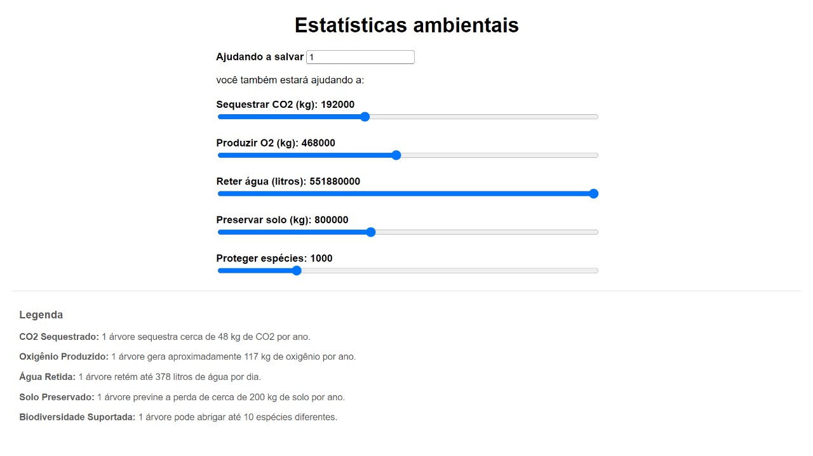

# Interface de para a tangibilização de benefícios ao adquirir tokens de árvores

## Introdução

Esta interface foi projetada para a certificadora de carbono Abundance Brasil, que tokeniza árvores e vende esses tokens como créditos de carbono. O objetivo principal desta interface é fornecer uma visualização clara e tangível dos benefícios ambientais proporcionados pela aquisição de tokens. Ela apresenta métricas importantes, como a quantidade de CO2 sequestrado, oxigênio produzido, água retida, solo preservado e espécies protegidas, associando diretamente esses valores ao número de árvores adquiridas.

A interface tem como foco principal criar uma experiência que torne mais palpável os impactos positivos que cada token representa, incentivando tanto empresas quanto indivíduos a comprar mais tokens e, consequentemente, contribuir para a preservação do meio ambiente.

## Métricas e Funcionalidades

### Sequestro de CO2

A interface calcula a quantidade de CO2 sequestrado com base no número de árvores adquiridas. Cada árvore sequestra aproximadamente 48 kg de CO2 por ano, e o cálculo apresentado na interface reflete o impacto acumulado ao longo de 40 anos por cada árvore adquirida.

**Importância**: A visualização do CO2 sequestrado ajuda a contextualizar o impacto ambiental positivo de uma maneira quantificável, reforçando o valor da compra de tokens para mitigar as emissões de carbono.

### Produção de Oxigênio

Cada árvore gera em torno de 117 kg de oxigênio por ano, com o valor acumulado ao longo de 40 anos. O oxigênio produzido é uma métrica tangível que simboliza a contribuição direta para a manutenção de uma atmosfera saudável.

**Importância**: A tangibilização da produção de oxigênio fornece uma métrica clara e significativa, aumentando o apelo emocional para o comprador, que passa a entender o impacto positivo na vida cotidiana e na saúde pública.

### Retenção de Água

Uma árvore pode reter até 378 litros de água por dia. A retenção de água é crucial para prevenir enchentes, melhorar a qualidade do solo e garantir a sustentabilidade dos recursos hídricos. A interface apresenta o valor acumulado ao longo de 40 anos.

**Importância**: A retenção de água reforça a ideia de que a compra de tokens não apenas impacta a atmosfera, mas também o ciclo hidrológico local, gerando valor tangível para o ecossistema.

### Preservação do Solo

Cada árvore preserva aproximadamente 200 kg de solo por ano, ajudando a prevenir erosão e desastres ambientais. A interface mostra a quantidade de solo preservado em função do número de árvores adquiridas.

**Importância**: A preservação do solo conecta o valor da compra de tokens com a estabilidade do ecossistema local, incentivando a aquisição de mais árvores como forma de proteger a biodiversidade e a agricultura.

### Proteção de Espécies

Cada árvore pode abrigar até 10 espécies diferentes. A interface permite que os usuários visualizem o impacto positivo na biodiversidade, mostrando quantas espécies podem ser beneficiadas pela preservação de árvores.

**Importância**: Ao associar cada árvore adquirida à proteção de espécies, a interface apela diretamente à sensibilidade em relação à biodiversidade, criando um vínculo emocional com o impacto ambiental.

## A Importância Psicológica da Contextualização e Tangibilização

A interface foi criada com um enfoque psicológico no conceito de tangibilização do valor. Estudos de marketing e comportamento do consumidor mostram que quanto mais palpável for o benefício percebido, maior será a probabilidade de compra. O objetivo é que, ao visualizar o impacto direto e mensurável da aquisição de tokens, o cliente se sinta emocionalmente engajado e mais propenso a comprar mais.

Além disso, a contextualização detalhada de métricas como CO2 sequestrado, oxigênio produzido e biodiversidade protegida oferece uma experiência psicológica gratificante. Ela permite que o comprador veja de forma clara o retorno positivo que está gerando, reforçando um senso de realização e propósito em suas escolhas de compra.

## Conclusão

Esta interface tem como principal objetivo oferecer uma visualização clara e envolvente do impacto ambiental gerado pela aquisição de tokens de árvores da Abundance Brasil. Ao associar métricas ambientais específicas e relevantes ao número de árvores adquiridas, a interface tangibiliza o valor dos tokens, criando um vínculo emocional e racional com os compradores. Com isso, ela incentiva a compra de mais tokens, contribuindo para a preservação do meio ambiente de forma concreta e psicologicamente gratificante.

Através da interface, empresas e indivíduos podem ver de maneira prática o impacto de suas decisões, e essa clareza é crucial para promover uma maior conscientização e engajamento nas questões ambientais.